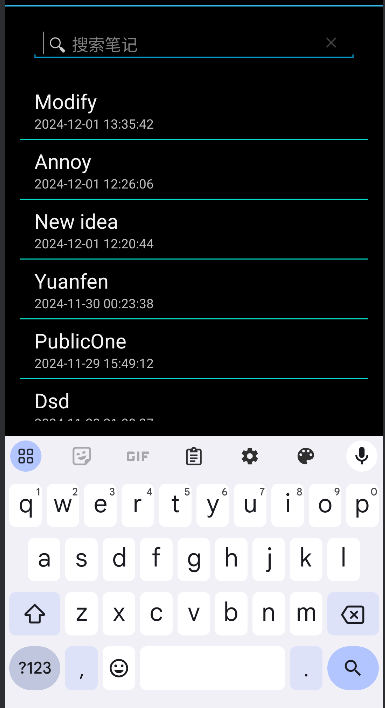
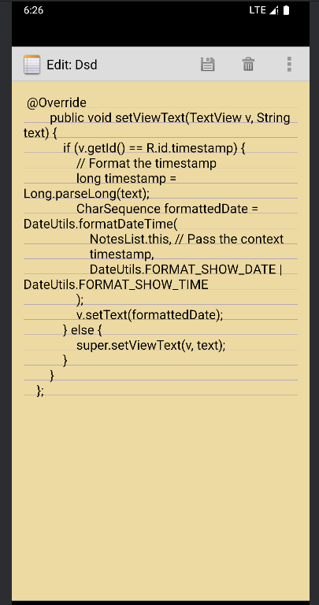

# 期中项目README

## 时间戳功能

### 效果展示：


### 实现思路：

1. NotePadProvider.java 中的时间戳插入和更新

```
@Override
public Uri insert(Uri uri, ContentValues initialValues) {
    // Validates the incoming URI. Only the full provider URI is allowed for inserts.
    if (sUriMatcher.match(uri) != NOTES) {
        throw new IllegalArgumentException("Unknown URI " + uri);
    }

    // A map to hold the new record's values.
    ContentValues values;

    // If the incoming values map is not null, uses it for the new values.
    if (initialValues != null) {
        values = new ContentValues(initialValues);

    } else {
        // Otherwise, create a new value map
        values = new ContentValues();
    }

    // Gets the current system time in milliseconds
    Long now = Long.valueOf(System.currentTimeMillis());

    // If the values map doesn't contain the creation date, sets the value to the current time.
    if (values.containsKey(NotePad.Notes.COLUMN_NAME_CREATE_DATE) == false) {
        values.put(NotePad.Notes.COLUMN_NAME_CREATE_DATE, now);
    }

    // If the values map doesn't contain the modification date, sets the value to the current
    // time.
    if (values.containsKey(NotePad.Notes.COLUMN_NAME_MODIFICATION_DATE) == false) {
        values.put(NotePad.Notes.COLUMN_NAME_MODIFICATION_DATE, now);
    }

    // 如果值映射中不包含标题，设置默认标题。
    if (values.containsKey(NotePad.Notes.COLUMN_NAME_TITLE) == false) {
        Resources r = Resources.getSystem();
        values.put(NotePad.Notes.COLUMN_NAME_TITLE, r.getString(android.R.string.untitled));
    }

    // 如果值映射中不包含笔记内容，设置为空字符串。
    if (values.containsKey(NotePad.Notes.COLUMN_NAME_NOTE) == false) {
        values.put(NotePad.Notes.COLUMN_NAME_NOTE, "");
    }

    // 打开数据库对象的“写”模式。
    SQLiteDatabase db = mOpenHelper.getWritableDatabase();

    // 执行插入操作并返回新笔记的行ID。
    long rowId = db.insert(
            NotePad.Notes.TABLE_NAME,        // 插入的表名
            NotePad.Notes.COLUMN_NAME_NOTE,  // 如果值映射为空，SQLite会将此列值设为null
            values                           // 包含列名和值的映射
    );

    // 如果插入成功，行ID存在。
    if (rowId > 0) {
        // 创建带有笔记ID模式的新URI。
        Uri noteUri = ContentUris.withAppendedId(NotePad.Notes.CONTENT_ID_URI_BASE, rowId);

        // 通知观察者数据已更改。
        getContext().getContentResolver().notifyChange(noteUri, null);
        return noteUri;
    }

    // 如果插入失败，抛出异常。
    throw new SQLException("Failed to insert row into " + uri);
}
```

#### 解释：

- 获取当前时间： Long now = Long.valueOf(System.currentTimeMillis());
- 获取当前系统时间的毫秒值。
- 设置创建时间： values.put(NotePad.Notes.COLUMN_NAME_CREATE_DATE, now);
- 如果插入的值映射中没有创建时间，则设置为当前时间。
- 设置修改时间： values.put(NotePad.Notes.COLUMN_NAME_MODIFICATION_DATE, now);
- 如果插入的值映射中没有修改时间，则设置为当前时间。

2. NoteEditor.java 中的时间戳更新

```
private final void updateNote(String text, String title) {
    // 设置一个包含要更新的值的映射。
    ContentValues values = new ContentValues();
    values.put(NotePad.Notes.COLUMN_NAME_MODIFICATION_DATE, System.currentTimeMillis());

    // 如果提供了新的标题，则更新标题。
    if (title != null) {
        values.put(NotePad.Notes.COLUMN_NAME_TITLE, title);
    }

    // 更新笔记内容。
    values.put(NotePad.Notes.COLUMN_NAME_NOTE, text);

    // 更新数据库中的记录。
    int count = getContentResolver().update(mUri, values, null, null);

    // 如果更新成功，通知观察者数据已更改。
    if (count > 0) {
        mCursor.requery();
        mOriginalContent = text;
    }
}
```

#### 解释：

- 设置修改时间： values.put(NotePad.Notes.COLUMN_NAME_MODIFICATION_DATE, System.currentTimeMillis());
- 在每次更新笔记时，设置修改时间为当前时间。
- 更新数据库记录： getContentResolver().update(mUri, values, null, null);
- 使用 ContentResolver 更新数据库中的记录，确保修改时间被更新。

3. NotesList.java 中的时间戳显示

```
SimpleCursorAdapter adapter = new SimpleCursorAdapter(
        this,
        R.layout.noteslist_item,
        cursor,
        new String[]{NotePad.Notes.COLUMN_NAME_TITLE, NotePad.Notes.COLUMN_NAME_MODIFICATION_DATE},
        new int[]{android.R.id.text1, R.id.timestamp},
        0
) {
    @Override
    public void setViewText(TextView v, String text) {
        if (v.getId() == R.id.timestamp) {
            long timestamp = Long.parseLong(text);
            SimpleDateFormat sdf = new SimpleDateFormat("yyyy-MM-dd HH:mm:ss", Locale.getDefault());
            sdf.setTimeZone(TimeZone.getTimeZone("Asia/Shanghai"));
            String formattedDate = sdf.format(new Date(timestamp));
            v.setText(formattedDate);
        } else {
            super.setViewText(v, text);
        }
    }
};
```

#### 解释：

- 解析时间戳： long timestamp = Long.parseLong(text);
- 将从数据库中获取的时间戳字符串转换为长整型。
- 格式化时间戳： SimpleDateFormat sdf = new SimpleDateFormat("yyyy-MM-dd HH:mm:ss", Locale.getDefault());
- 使用 SimpleDateFormat 将时间戳格式化为可读的日期时间字符串。
- 设置时间戳文本： v.setText(formattedDate);
- 将格式化后的日期时间字符串设置到 TextView 中。

## 笔记查询功能

### 效果展示





### 实现思路

1. NotesList.java 中的 performSearch 方法

```
private void performSearch(String query) {
    if (query.isEmpty()) {
        // 恢复到初始状态，显示所有笔记
        Cursor cursor = managedQuery(
                NotePad.Notes.CONTENT_URI,
                PROJECTION,
                null,
                null,
                NotePad.Notes.DEFAULT_SORT_ORDER
        );
        SimpleCursorAdapter adapter = (SimpleCursorAdapter) getListAdapter();
        adapter.changeCursor(cursor);
    } else {
        String selection = NotePad.Notes.COLUMN_NAME_TITLE + " LIKE ? OR " + NotePad.Notes.COLUMN_NAME_NOTE + " LIKE ?";
        String[] selectionArgs = {"%" + query + "%", "%" + query + "%"};
        Cursor cursor = managedQuery(
                NotePad.Notes.CONTENT_URI, // 直接使用 NotePad.Notes.CONTENT_URI 而不是 Uri.withAppendedPath
                PROJECTION,
                selection,
                selectionArgs,
                NotePad.Notes.DEFAULT_SORT_ORDER
        );

        // 添加日志输出，检查查询结果
        if (cursor == null || cursor.getCount() == 0) {
            Log.d(TAG, "No notes found for query: " + query);
        } else {
            Log.d(TAG, "Found " + cursor.getCount() + " notes for query: " + query);
        }

        SimpleCursorAdapter adapter = (SimpleCursorAdapter) getListAdapter();
        adapter.changeCursor(cursor);
    }
}
```

#### 解释：

- 功能：
  : 这个方法用于执行笔记的搜索操作。它根据用户输入的查询字符串 query 来过滤笔记列表。

- 逻辑：
  : 如果查询字符串为空，则恢复到初始状态，显示所有笔记。
  : 否则，构建一个 SQL 查询语句，使用 LIKE 关键字来匹配笔记的标题或内容。
  : 执行查询并更新 SimpleCursorAdapter 以显示新的查询结果。
  : 添加日志输出，用于调试和检查查询结果。

2. NotePadProvider.java 中的 query 方法

```
@Override
public Cursor query(Uri uri, String[] projection, String selection, String[] selectionArgs, String sortOrder) {
    SQLiteQueryBuilder qb = new SQLiteQueryBuilder();
    qb.setTables(NotePad.Notes.TABLE_NAME);

    switch (sUriMatcher.match(uri)) {
        case NOTES:
            qb.setProjectionMap(sNotesProjectionMap);
            break;
        case NOTE_ID:
            qb.setProjectionMap(sNotesProjectionMap);
            qb.appendWhere(NotePad.Notes._ID + "=" + uri.getPathSegments().get(NotePad.Notes.NOTE_ID_PATH_POSITION));
            break;
        case LIVE_FOLDER_NOTES:
            qb.setProjectionMap(sLiveFolderProjectionMap);
            break;
        case NOTES_SEARCH:
            qb.setProjectionMap(sNotesProjectionMap);
            if (selection != null && !selection.isEmpty()) {
                qb.appendWhere(selection);
            }
            break;
        default:
            throw new IllegalArgumentException("Unknown URI " + uri);
    }

    String orderBy;
    if (TextUtils.isEmpty(sortOrder)) {
        orderBy = NotePad.Notes.DEFAULT_SORT_ORDER;
    } else {
        orderBy = sortOrder;
    }

    SQLiteDatabase db = mOpenHelper.getReadableDatabase();
    Cursor c = qb.query(db, projection, selection, selectionArgs, null, null, orderBy);
    c.setNotificationUri(getContext().getContentResolver(), uri);
    return c;
}
```

#### 解释：

- 功能：这个方法是 NotePadProvider 中的核心方法，用于处理来自客户端的查询请求。
- 逻辑：
  : 使用 SQLiteQueryBuilder 构建查询。
  : 根据传入的 URI 匹配不同的模式（如 NOTES、NOTE_ID、LIVE_FOLDER_NOTES 和 NOTES_SEARCH）来设置不同的查询条件。
  : 对于 NOTES_SEARCH 模式，如果传入的 selection 不为空，则将其附加到查询条件中。
  : 设置默认的排序顺序，如果客户端没有指定排序顺序。
  : 执行查询并返回 Cursor 对象。
  : 设置通知 URI，以便在数据变化时通知客户端

## UI美化

### 效果展示





### 实现思路

1. 动画和过渡效果

```
// 设置过渡效果
    postponeEnterTransition();
    adapter.registerDataSetObserver(new DataSetObserver() {
        @Override
        public void onChanged() {
            super.onChanged();
            startPostponedEnterTransition();
        }
    }
```

#### 解释：

- postponeEnterTransition() 方法用于延迟进入动画的开始。
- registerDataSetObserver() 方法用于注册数据集观察者，当数据集发生变化时，会调用 onChanged() 方法。
- startPostponedEnterTransition() 方法用于开始延迟的进入动画。
- 通过这种方式，可以确保进入动画在数据加载完成后才开始执行。
- 添加简单的动画效果，提升用户体验，使用 SharedElementTransition，实现平滑的页面切换效果

2. 更改笔记背景颜色

```
@Override
public boolean onOptionsItemSelected(MenuItem item) {
    // Handle all of the possible menu actions.
    switch (item.getItemId()) {
        case R.id.menu_save:
            String text = mText.getText().toString();
            updateNote(text, null);
            finish();
            break;
        case R.id.menu_delete:
            deleteNote();
            finish();
            break;
        case R.id.menu_revert:
            cancelNote();
            break;
        case R.id.menu_export:
            exportNote();
            break;
        case R.id.menu_change_background:
            showColorPickerDialog();
            return true;
    }
    return super.onOptionsItemSelected(item);
}

private void showColorPickerDialog() {
    final String[] colors = {"Shallow_yellow", "Shallow_blue", "Shallow_gray", "white", "Shallow_red"};
    AlertDialog.Builder builder = new AlertDialog.Builder(this);
    builder.setTitle("Choose Background Color")
            .setItems(colors, new DialogInterface.OnClickListener() {
                @Override
                public void onClick(DialogInterface dialog, int which) {
                    int colorResId = getResources().getIdentifier(colors[which], "color", getPackageName());
                    mText.setBackgroundColor(getResources().getColor(colorResId));
                }
            });
    builder.create().show();
}
```

#### 解释：

- onOptionsItemSelected 方法：
  : 处理菜单项的选择。当用户选择 R.id.menu_change_background 时，调用 showColorPickerDialog 方法。

- showColorPickerDialog 方法：
  : 创建一个包含多种颜色选项的对话框。
  : 用户选择一种颜色后，通过 getResources().getIdentifier 获取颜色资源的 ID。
  : 使用 getResources().getColor 获取颜色值，并将其设置为 mText（即笔记编辑区域）的背景颜色。

3. 笔记编辑界面的布局

```
<!-- res/layout/note_editor.xml -->
<view xmlns:android="http://schemas.android.com/apk/res/android"
    android:id="@+id/note"
    class="com.example.android.notepad.NoteEditor$LinedEditText"
    android:layout_width="match_parent"
    android:layout_height="match_parent"
    android:background="@color/Shallow_yellow"
    android:capitalize="sentences"
    android:fadingEdge="vertical"
    android:gravity="top"
    android:padding="16dp"
    android:scrollbars="vertical"
    android:textSize="18sp" />
```

#### 解释：

- class 属性：
  : 指定了自定义的 LinedEditText 类，该类在笔记编辑区域中绘制线条。

- android:background 属性：
  : 设置了笔记编辑区域的背景颜色为 @color/Shallow_yellow。

- 其他属性：
  : android:capitalize="sentences"：自动将句子的首字母大写。
  : android:fadingEdge="vertical"：启用垂直渐变边缘效果。
  : android:gravity="top"：内容对齐方式为顶部对齐。
  : android:padding="16dp"：设置内边距。
  : android:scrollbars="vertical"：启用垂直滚动条。
  : android:textSize="18sp"：设置文本大小。

4. 自定义 LinedEditText 类

```
public static class LinedEditText extends EditText {
    private Rect mRect;
    private Paint mPaint;

    // This constructor is used by LayoutInflater
    public LinedEditText(Context context, AttributeSet attrs) {
        super(context, attrs);

        // Creates a Rect and a Paint object, and sets the style and color of the Paint object.
        mRect = new Rect();
        mPaint = new Paint();
        mPaint.setStyle(Paint.Style.STROKE);
        mPaint.setColor(0x800000FF);
    }

    /**
     * This is called to draw the LinedEditText object
     * @param canvas The canvas on which the background is drawn.
     */
    @Override
    protected void onDraw(Canvas canvas) {

        // Gets the number of lines of text in the View.
        int count = getLineCount();

        // Gets the global Rect and Paint objects
        Rect r = mRect;
        Paint paint = mPaint;

        /*
         * Draws one line in the rectangle for every line of text in the EditText
         */
        for (int i = 0; i < count; i++) {

            // Gets the baseline coordinates for the current line of text
            int baseline = getLineBounds(i, r);

            /*
             * Draws a line in the background from the left of the rectangle to the right,
             * at a vertical position one dip below the baseline, using the "paint" object
             * for details.
             */
            canvas.drawLine(r.left, baseline + 1, r.right, baseline + 1, paint);
        }

        // Finishes up by calling the parent method
        super.onDraw(canvas);
    }
}
```

#### 解释：

- LinedEditText 类：
  : 继承自 EditText，用于在笔记编辑区域中绘制线条。

- mRect 和 mPaint 成员变量：
  : 分别用于存储矩形和画笔对象。

- onDraw 方法：
  : 获取当前视图中的文本行数。
  : 遍历每一行文本，获取基线坐标。
  : 在每一行文本的基线下方绘制一条水平线。
  : 最后调用父类的 onDraw 方法完成绘制。

5. 其他：

- 优化各个布局文件，增加间距和边距，使布局更加美观。
- 增加颜色文件，添加多个颜色项，丰富颜色选择
- 增加string文件，添加多个string选项，丰富字符串选择

## 导出笔记功能

### 效果展示


### 实现思路
1. 在 NoteEditor.java 文件中，导出笔记的功能主要集中在 exportNote() 方法中
```
private void exportNote() {
    String title = mCursor.getString(mCursor.getColumnIndex(NotePad.Notes.COLUMN_NAME_TITLE));
    String content = mText.getText().toString();

    // Create a file name
    String fileName = title.replaceAll("[^a-zA-Z0-9]", "_") + ".txt";

    // Get the desktop directory
    File dir = new File(Environment.getExternalStorageDirectory(), "Download"); // 修改这里
    if (!dir.exists()) {
        dir.mkdirs();
    }

    // Create a file
    File file = new File(dir, fileName);

    if (Build.VERSION.SDK_INT >= Build.VERSION_CODES.M) {
        if (checkSelfPermission(Manifest.permission.WRITE_EXTERNAL_STORAGE) != PackageManager.PERMISSION_GRANTED) {
            requestPermissions(new String[]{Manifest.permission.WRITE_EXTERNAL_STORAGE}, REQUEST_WRITE_STORAGE);
            return;
        }
    }
    try {
        // Write the note content to the file
        FileOutputStream fos = new FileOutputStream(file);
        fos.write(content.getBytes());
        fos.close();

        // Show a toast message
        Toast.makeText(this, "Note exported to " + file.getAbsolutePath(), Toast.LENGTH_LONG).show();
    } catch (IOException e) {
        e.printStackTrace();
        Toast.makeText(this, "Failed to export note", Toast.LENGTH_SHORT).show();
    }
}
```

#### 解释：

- title：从 mCursor 中获取当前笔记的标题。
- content：从 mText（即 EditText 控件）中获取当前笔记的内容。
- 使用正则表达式将标题中的非字母数字字符替换为下划线，并添加 .txt 扩展名，生成文件名
- 获取外部存储的下载目录。 如果目录不存在，则创建目录
- 如果设备的 API 级别大于等于 23（Marshmallow），检查是否已授予写入外部存储的权限。 如果没有权限，请求权限并返回。
- 使用 FileOutputStream 将笔记内容写入文件。 写入成功后，显示一条 Toast 消息，告知用户文件已导出的路径。 如果写入过程中发生 IOException，捕获异常并显示失败的 Toast 消息。
